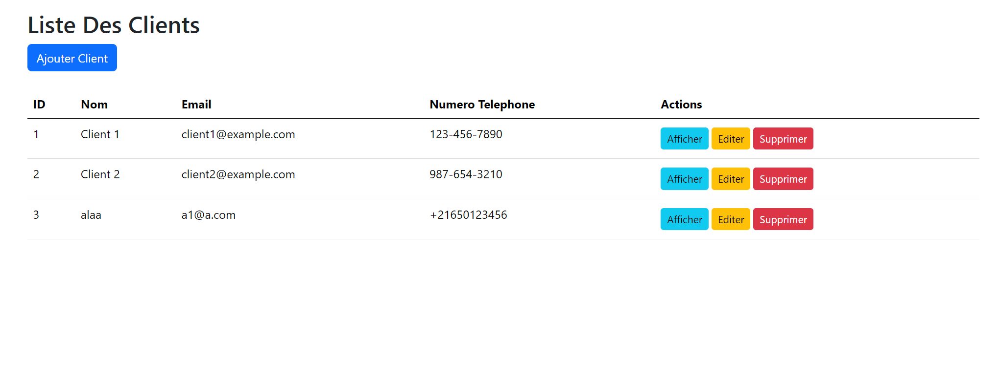
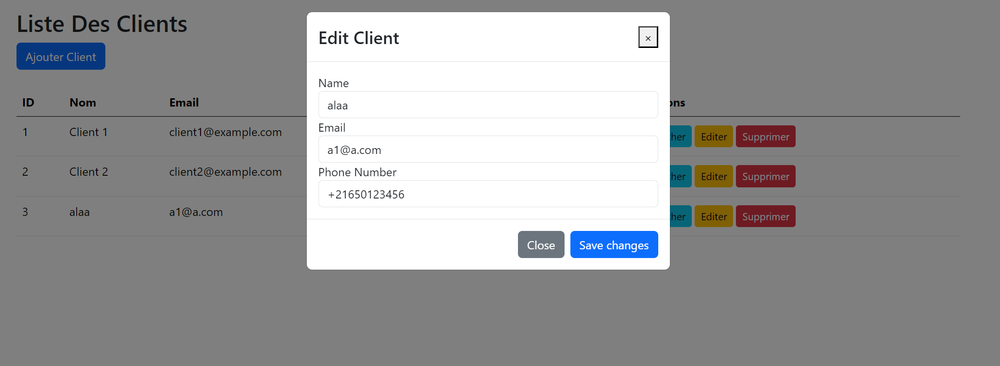

# Gestion des Comptes Utilisateurs et Bancaires avec Angular

Cette partie du projet Angular offre la possibilité de gérer à la fois les comptes utilisateurs et les comptes bancaires, avec des fonctionnalités distinctes pour chacun.

## Gestion des Comptes Utilisateurs

Le composant `ListeClientsComponent` permet de gérer les informations des clients, notamment leur nom, adresse e-mail, numéro de téléphone, etc. Les principales fonctionnalités incluent l'ajout, la mise à jour et la suppression de clients. Les données des clients sont stockées localement à l'aide de `localStorage`.

### Fonctionnalités

- Affichage de la liste des clients avec leurs détails.
- Ajout d'un nouveau client en remplissant un formulaire modal.
- Mise à jour des informations d'un client existant via le même formulaire modal.
- Suppression d'un client de la liste.
- Stockage des données des clients dans `localStorage`.

### Capture d'écran

## Gestion des Comptes

Le composant `ComptesBancairesComponent` permet de gérer les comptes bancaires associés à chaque client. Le composant comporte également un formulaire modal pour ajouter, mettre à jour et supprimer des comptes bancaires. Les relevés bancaires associés à chaque compte sont également pris en charge par le composant `RelevesBancairesComponent`.

### Fonctionnalités

- Affichage des clients avec leurs comptes bancaires et soldes associés.
- Ajout, mise à jour et suppression de comptes bancaires pour chaque client.
- Gestion des relevés bancaires avec la possibilité d'ajouter de nouvelles opérations.
- Stockage des données des clients dans `localStorage`.

### Capture d'écran

